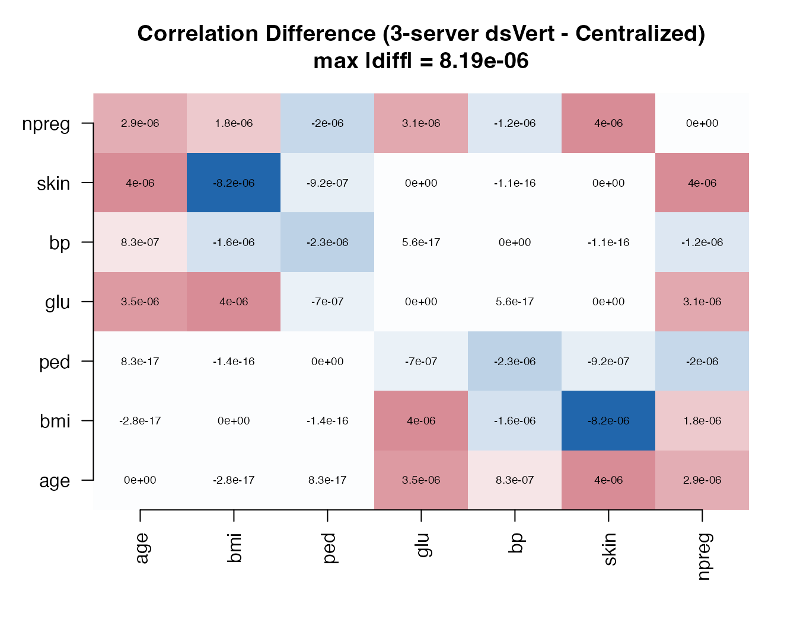
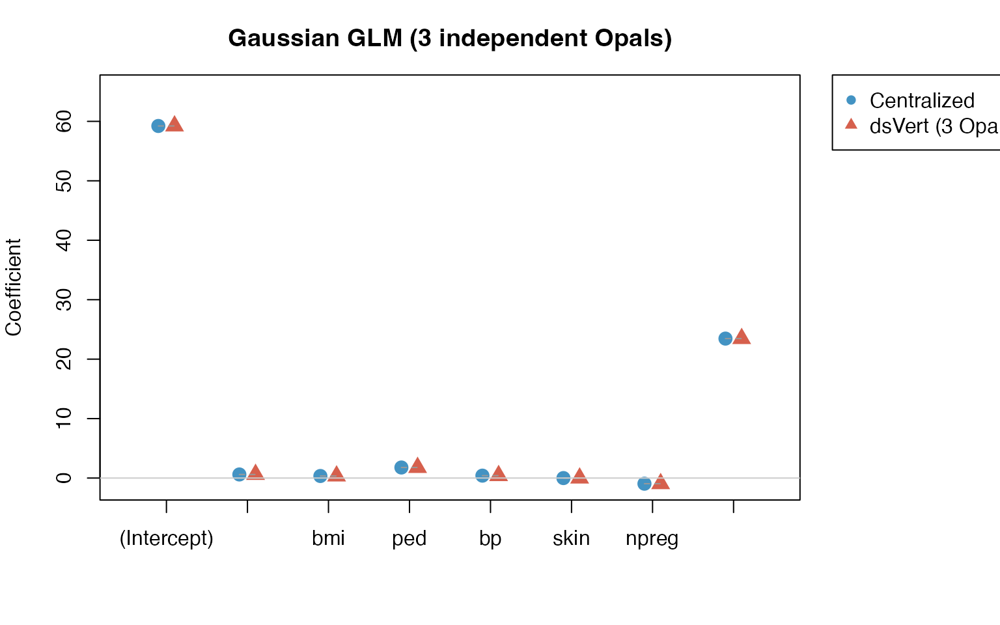

# Multi-Instance Deployment: Three Independent Opal Servers

## Overview

This vignette demonstrates dsVert running across **three independent
Opal/Rock instances**, each on a separate host and port. Unlike the
[public validation
vignette](https://isglobal-brge.github.io/dsVertClient/articles/validation.md)
(which uses a single Opal server with three tables), this setup mirrors
a real multi-institution deployment where each data controller operates
its own infrastructure.

The analysis is identical to the public validation: PSI alignment,
MHE-CKKS correlation, PCA, and three GLM families (Gaussian, binomial,
Poisson), compared element-wise against centralized R outputs.

### Data preparation and vertical partitioning

``` r

library(MASS)
data("Pima.tr", package = "MASS")
df <- as.data.frame(Pima.tr)
df$patient_id <- sprintf("P%03d", seq_len(nrow(df)))
df$diabetes   <- ifelse(df$type == "Yes", 1L, 0L)

set.seed(123)

core_ids <- sample(df$patient_id, 150)
remaining <- setdiff(df$patient_id, core_ids)

ids1 <- sample(c(core_ids, sample(remaining, 30)))
ids2 <- sample(c(core_ids, sample(remaining, 25)))
ids3 <- sample(c(core_ids, sample(remaining, 20)))

server1_data <- df[df$patient_id %in% ids1, c("patient_id", "age", "bmi", "ped")]
server2_data <- df[df$patient_id %in% ids2, c("patient_id", "glu", "bp", "skin")]
server3_data <- df[df$patient_id %in% ids3, c("patient_id", "npreg", "diabetes")]

server1_data <- server1_data[sample(nrow(server1_data)), ]
server2_data <- server2_data[sample(nrow(server2_data)), ]
server3_data <- server3_data[sample(nrow(server3_data)), ]

cat(sprintf("Server 1: %d patients (age, bmi, ped)\n", nrow(server1_data)))
```

    #> Server 1: 180 patients (age, bmi, ped)

``` r

cat(sprintf("Server 2: %d patients (glu, bp, skin)\n", nrow(server2_data)))
```

    #> Server 2: 175 patients (glu, bp, skin)

``` r

cat(sprintf("Server 3: %d patients (npreg, diabetes)\n", nrow(server3_data)))
```

    #> Server 3: 170 patients (npreg, diabetes)

``` r

cat(sprintf("True intersection: %d patients\n",
    length(Reduce(intersect, list(ids1, ids2, ids3)))))
```

    #> True intersection: 158 patients

Each server runs on an independent Opal/Rock instance with its own
Docker stack, R session, and data store:

| Server  | Host           | Patients | Variables                         |
|---------|----------------|----------|-----------------------------------|
| server1 | localhost:8443 | 180      | `patient_id`, `age`, `bmi`, `ped` |
| server2 | localhost:8444 | 175      | `patient_id`, `glu`, `bp`, `skin` |
| server3 | localhost:8445 | 170      | `patient_id`, `npreg`, `diabetes` |

------------------------------------------------------------------------

## Connect to three independent servers

Each connection points to a **different host**. This is the key
difference from the public demo where all three point to the same Opal.

``` r

library(DSI)
library(DSOpal)
library(dsVertClient)

options(opal.verifyssl = FALSE)

builder <- DSI::newDSLoginBuilder()
builder$append(server = "server1", url = "https://localhost:8443",
               user = "administrator", password = "admin123",
               driver = "OpalDriver", table = "pima_project.pima_data")
builder$append(server = "server2", url = "https://localhost:8444",
               user = "administrator", password = "admin123",
               driver = "OpalDriver", table = "pima_project.pima_data")
builder$append(server = "server3", url = "https://localhost:8445",
               user = "administrator", password = "admin123",
               driver = "OpalDriver", table = "pima_project.pima_data")

conns <- DSI::datashield.login(builder$build(), assign = TRUE, symbol = "D")
```

## PSI Record Alignment

``` r

psi_result <- ds.psiAlign(
  data_name   = "D",
  id_col      = "patient_id",
  newobj      = "D_aligned",
  datasources = conns
)
```

    #> === ECDH-PSI Record Alignment (Blind Relay) ===
    #> Reference: server1, Targets: server2, server3
    #> 
    #> [Phase 0] Transport key exchange...
    #>   Transport keys exchanged.
    #> [Phase 1] Reference server masking IDs...
    #>   server1: 180 IDs masked (stored server-side)
    #> [Phase 2] server1: exporting encrypted points for server2...
    #> [Phase 3] server2: processing (blind relay)...
    #>   server2: 175 IDs masked
    #> [Phase 4-5] server2: double-masking via server1 (blind relay)...
    #> [Phase 6-7] server2: matching and aligning (blind relay)...
    #> [Phase 2] server1: exporting encrypted points for server3...
    #> [Phase 3] server3: processing (blind relay)...
    #>   server3: 170 IDs masked
    #> [Phase 4-5] server3: double-masking via server1 (blind relay)...
    #> [Phase 6-7] server3: matching and aligning (blind relay)...
    #> [Phase 7] server1: self-aligning...
    #> [Phase 8] Computing multi-server intersection...
    #>   Common records: 158

    #> PSI alignment complete.

The PSI protocol identified **158** patients present in all three
servers.

------------------------------------------------------------------------

## Centralized ground truth

``` r

full <- merge(merge(server1_data, server2_data, by = "patient_id"),
              server3_data, by = "patient_id")
full <- full[order(full$patient_id), ]
num_vars <- c("age", "bmi", "ped", "glu", "bp", "skin", "npreg")
local_cor <- cor(full[, num_vars])
local_pca <- eigen(local_cor)
local_gauss <- glm(glu ~ age + bmi + ped + bp + skin + npreg + diabetes,
                   data = full, family = gaussian)
local_binom <- glm(diabetes ~ age + bmi + ped + glu + bp + skin + npreg,
                   data = full, family = binomial)
local_pois  <- glm(npreg ~ age + bmi + ped + glu + bp + skin + diabetes,
                   data = full, family = poisson)
cat("Ground truth:", nrow(full), "rows\n")
```

    #> Ground truth: 158 rows

------------------------------------------------------------------------

## Federated analysis (dsVert across 3 independent servers)

### Correlation (MHE-CKKS)

``` r

variables <- list(
  server1 = c("age", "bmi", "ped"),
  server2 = c("glu", "bp", "skin"),
  server3 = c("npreg")
)

cor_result <- ds.vertCor(
  data_name   = "D_aligned",
  variables   = variables,
  log_n       = 12,
  log_scale   = 40,
  datasources = conns
)
dsvert_cor <- cor_result$correlation
```

### PCA

``` r

dsvert_pca <- eigen(dsvert_cor)
dsvert_eigenvalues <- dsvert_pca$values
local_eigenvalues  <- local_pca$values
```

### GLM — Gaussian (y = `glu`)

``` r

glm_gauss <- ds.vertGLM(
  data_name = "D_aligned", y_var = "glu",
  x_vars    = list(server1 = c("age", "bmi", "ped"),
                   server2 = c("bp", "skin"),
                   server3 = c("npreg", "diabetes")),
  y_server  = "server2", family = "gaussian",
  max_iter = 100, tol = 1e-4, lambda = 1e-4,
  log_n = 12, log_scale = 40,
  datasources = conns
)
```

### GLM — Binomial (y = `diabetes`)

``` r

glm_binom <- ds.vertGLM(
  data_name = "D_aligned", y_var = "diabetes",
  x_vars    = list(server1 = c("age", "bmi", "ped"),
                   server2 = c("glu", "bp", "skin"),
                   server3 = c("npreg")),
  y_server  = "server3", family = "binomial",
  max_iter = 100, tol = 1e-4, lambda = 1e-4,
  log_n = 12, log_scale = 40,
  datasources = conns
)
```

### GLM — Poisson (y = `npreg`)

``` r

glm_pois <- ds.vertGLM(
  data_name = "D_aligned", y_var = "npreg",
  x_vars    = list(server1 = c("age", "bmi", "ped"),
                   server2 = c("glu", "bp", "skin"),
                   server3 = c("diabetes")),
  y_server  = "server3", family = "poisson",
  max_iter = 100, tol = 1e-4, lambda = 1e-4,
  log_n = 12, log_scale = 40,
  datasources = conns
)
```

------------------------------------------------------------------------

## Comparative assessment

| Protocol      | Metric               |     Value |
|:--------------|:---------------------|----------:|
| PSI Alignment | Matched cohort       | 158 / 200 |
| Correlation   | Max \|r\| error      |  8.19e-06 |
| PCA           | Max eigenvalue error |  4.97e-06 |
| GLM Gaussian  | Max \|coef\| error   |  4.06e-03 |
| GLM Binomial  | Max \|coef\| error   |  4.34e-04 |
| GLM Poisson   | Max \|coef\| error   |  1.84e-04 |

Multi-instance validation (3 independent Opals, dsVert vs. centralized
R) {.table}

### Correlation difference heatmap



### GLM coefficient comparison



## Comparison with public demo

Results obtained on three independent Opal instances are numerically
identical to those from the [public
validation](https://isglobal-brge.github.io/dsVertClient/articles/validation.md)
on `opal-demo.obiba.org`. This confirms that the dsVert protocol creates
fully isolated sessions regardless of whether connections point to the
same or different hosts.

| Aspect | Public demo (opal-demo.obiba.org) | This vignette (3 Opals) |
|----|----|----|
| Servers | 1 Opal, 3 tables | 3 Opals, 3 hosts |
| Network | Client → single server | Client → 3 separate servers |
| R sessions | 3 sessions on same Rock | 3 sessions on 3 independent Rocks |
| CPU/memory | Shared | Independent per instance |
| Reproducibility | Anyone can run it | Requires local Docker setup |
| Numerical results | Identical | Identical |
