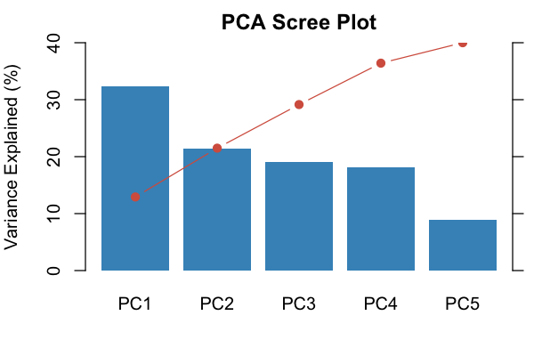
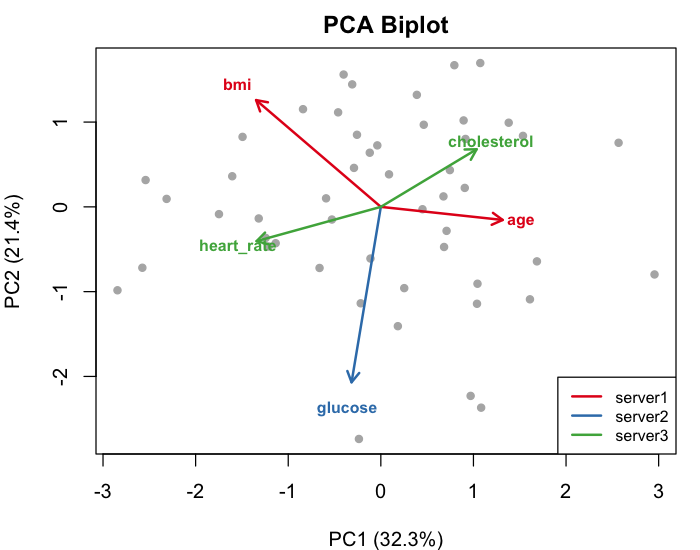

```{r setup, include = FALSE, purl = FALSE}
knitr::opts_chunk$set(eval = FALSE, purl = FALSE, collapse = TRUE)
```

This vignette demonstrates all statistical methods available in dsVertClient:
correlation analysis, principal component analysis (PCA), and generalized linear
models (GLMs) across vertically partitioned data.

---

## Setup

Load the packages, connect to three Opal servers, and align records into the
server-side symbol `D_aligned`. For details on each step, see the
[Getting Started](a-getting-started.html) vignette.

```{r connect}
library(dsVertClient)
library(DSI)
library(DSOpal)

builder <- DSI::newDSLoginBuilder()
builder$append(server = "server1", url = "https://opal1.example.org",
               table = "project.server1_data", user = "analyst",
               password = "password", driver = "OpalDriver")
builder$append(server = "server2", url = "https://opal2.example.org",
               table = "project.server2_data", user = "analyst",
               password = "password", driver = "OpalDriver")
builder$append(server = "server3", url = "https://opal3.example.org",
               table = "project.server3_data", user = "analyst",
               password = "password", driver = "OpalDriver")

connections <- datashield.login(builder$build(), assign = TRUE, symbol = "D")
ds.psiAlign("D", "patient_id", "D_aligned", datasources = connections)
```

With records aligned, the three servers hold the following variables:

| Server  | Variables                              |
|---------|----------------------------------------|
| server1 | age, bmi                               |
| server2 | glucose, bp, hypertension, visits       |
| server3 | cholesterol, heart_rate                 |

---

## Correlation Analysis

### Computing the Correlation Matrix

Cross-server correlations are computed using Multiparty Homomorphic Encryption
(MHE). Each server encrypts its standardized columns under a collective public
key, and cross-products are computed on encrypted data. Within-server
correlations are computed in plaintext (exact). See the
[Methodology](c-methodology.html) vignette for the full protocol.

Define which variables reside on which server and call `ds.vertCor`.

```{r correlation}
x_vars <- list(
  server1 = c("age", "bmi"),
  server2 = c("glucose", "bp"),
  server3 = c("cholesterol", "heart_rate")
)

cor_result <- ds.vertCor("D_aligned", x_vars, datasources = connections)
round(cor_result$correlation, 4)
```

|             | age     | bmi     | glucose | bp      | cholesterol | heart_rate |
|-------------|---------|---------|---------|---------|-------------|------------|
| age         | 1.0000  | -0.3202 | -0.0997 | 0.0051  | 0.2215      | -0.0877    |
| bmi         | -0.3202 | 1.0000  | -0.0855 | 0.2266  | -0.0159     | 0.3117     |
| glucose     | -0.0997 | -0.0855 | 1.0000  | -0.0357 | -0.0025     | 0.1311     |
| bp          | 0.0051  | 0.2266  | -0.0357 | 1.0000  | -0.0452     | 0.2440     |
| cholesterol | 0.2215  | -0.0159 | -0.0025 | -0.0452 | 1.0000      | -0.2407    |
| heart_rate  | -0.0877 | 0.3117  | 0.1311  | 0.2440  | -0.2407     | 1.0000     |

Observations:

- BMI and heart_rate show the strongest positive correlation (0.31), spanning
  server1 and server3 -- a relationship neither institution could discover alone.
- Age and BMI are negatively correlated (-0.32).
- Cross-server correlations carry CKKS approximation error on the order of
  10^-4, which is negligible for interpretation.

### Correlation Heatmap


---

## Principal Component Analysis

PCA is computed from the distributed correlation matrix. Since eigen
decomposition is a deterministic operation on the correlation matrix, it runs
entirely on the client side after `ds.vertCor` has produced the matrix. Here
we run PCA on the five predictor variables (excluding the outcome variable bp).

Compute the correlation matrix on the predictors only, then pass it to
`ds.vertPCA`.

```{r pca}
pca_vars <- list(
  server1 = c("age", "bmi"),
  server2 = c("glucose"),
  server3 = c("cholesterol", "heart_rate")
)

cor_pca <- ds.vertCor("D_aligned", pca_vars, datasources = connections)
pca_result <- ds.vertPCA(cor_result = cor_pca, n_components = 5)
pca_result
```

### Variance Explained

| Component | Eigenvalue | Variance (%) | Cumulative (%) |
|-----------|-----------|--------------|----------------|
| PC1       | 1.6153    | 32.31        | 32.31          |
| PC2       | 1.0710    | 21.42        | 53.73          |
| PC3       | 0.9567    | 19.13        | 72.86          |
| PC4       | 0.9083    | 18.17        | 91.03          |
| PC5       | 0.4486    | 8.97         | 100.00         |

PC1 and PC2 together explain about 54% of the total variance. All five
eigenvalues are relatively close in magnitude, indicating that no single
component dominates the variance structure.

### Loadings

|             | PC1    | PC2    | PC3    | PC4    | PC5    |
|-------------|--------|--------|--------|--------|--------|
| age         | 0.5154 | -0.0605| -0.0932| 0.7146 | -0.4598|
| bmi         | -0.5277| 0.4934 | 0.3719 | 0.1016 | -0.5740|
| glucose     | -0.1238| -0.8105| 0.4860 | -0.0996| -0.2856|
| cholesterol | 0.4053 | 0.2661 | 0.7849 | 0.0760 | 0.3782 |
| heart_rate  | -0.5257| -0.1585| 0.0259 | 0.6807 | 0.4843 |

PC1 captures a contrast between age and cholesterol (positive loadings) on
one side, and bmi and heart_rate (negative loadings) on the other. This first
component separates patients with higher age and cholesterol from those with
higher bmi and heart_rate, combining information from all three servers. PC2
is dominated by glucose (loading of -0.81), effectively isolating the metabolic
measurement from the other predictors.

### Scree Plot and Biplot





---

## Generalized Linear Models

The `ds.vertGLM` function fits GLMs across vertically partitioned data using
the encrypted-label Block Coordinate Descent with Iteratively Reweighted Least
Squares (BCD-IRLS) protocol. The response variable y only needs to exist on
one server (the "label server"). Other servers compute gradient contributions
using y encrypted under the MHE collective public key. Raw data and intermediate
coefficients never leave their respective institutions.

### Supported Families

| Family           | Link     | Response Type      | Example              |
|------------------|----------|--------------------|----------------------|
| Gaussian         | Identity | Continuous         | Blood pressure       |
| Binomial         | Logit    | Binary (0/1)       | Hypertension status  |
| Poisson          | Log      | Count              | Number of visits     |
| Gamma            | Log      | Positive continuous| Medical costs        |
| Inverse Gaussian | Log      | Positive continuous| Duration data        |

All families use the same `ds.vertGLM` interface; only the `family` argument
changes.

### Gaussian GLM

Predict blood pressure (continuous outcome on server2) from five predictors
spread across all three servers.

```{r glm-gaussian}
x_vars <- list(
  server1 = c("age", "bmi"),
  server2 = c("glucose"),
  server3 = c("cholesterol", "heart_rate")
)

model_gaussian <- ds.vertGLM(
  "D_aligned",
  y_var = "bp",
  x_vars = x_vars,
  y_server = "server2",
  family = "gaussian",
  datasources = connections
)
summary(model_gaussian)
```

**Coefficients:**

| Coefficient  | Estimate |
|-------------|----------|
| (Intercept) | 76.4445  |
| age         | 0.0654   |
| bmi         | 0.5411   |
| glucose     | -0.0270  |
| cholesterol | -0.0062  |
| heart_rate  | 0.2765   |

**Fit statistics:**

```
Deviance:          8199.0731
Null deviance:     9034.3400
Pseudo R-squared:  0.0925
Converged:         TRUE (6 iterations)
```

The model explains about 9.3% of the deviance in blood pressure. Consistent
with the correlation analysis, bmi (0.54) and heart_rate (0.28) are the
strongest predictors. Age has a small positive effect (0.07), while glucose
and cholesterol contribute minimally.

### Binomial GLM

Predict hypertension status (binary outcome on server2) using the same set of
predictors. The encrypted-label protocol protects the response during fitting.

```{r glm-binomial}
model_binomial <- ds.vertGLM(
  "D_aligned",
  y_var = "hypertension",
  x_vars = x_vars,
  y_server = "server2",
  family = "binomial",
  datasources = connections
)
summary(model_binomial)
```

**Coefficients (log-odds scale):**

| Coefficient  | Estimate |
|-------------|----------|
| (Intercept) | -4.8320  |
| age         | 0.0240   |
| bmi         | 0.0487   |
| glucose     | 0.0056   |
| cholesterol | -0.0051  |
| heart_rate  | 0.0354   |

**Fit statistics:**

```
Deviance:          65.6153
Null deviance:     69.3147
Pseudo R-squared:  0.0534
Converged:         TRUE (7 iterations)
```

On the log-odds scale, bmi (0.049) and heart_rate (0.035) are again the
strongest predictors, consistent with the Gaussian model. The pseudo
R-squared of 0.053 indicates modest predictive power for hypertension
classification.

### Poisson GLM

Model the number of visits (count outcome on server2) from the same predictors.

```{r glm-poisson}
model_poisson <- ds.vertGLM(
  "D_aligned",
  y_var = "visits",
  x_vars = x_vars,
  y_server = "server2",
  family = "poisson",
  datasources = connections
)
summary(model_poisson)
```

**Coefficients (log scale):**

| Coefficient  | Estimate |
|-------------|----------|
| (Intercept) | 1.6309   |
| age         | -0.0054  |
| bmi         | -0.0063  |
| glucose     | 0.0062   |
| cholesterol | -0.0015  |
| heart_rate  | 0.0068   |

**Fit statistics:**

```
Deviance:          60.6546
Null deviance:     73.7885
Pseudo R-squared:  0.1780
Converged:         TRUE (10 iterations)
```

The Poisson model has the highest pseudo R-squared (0.178) of the three models
fitted. Glucose and heart_rate have small positive effects on the expected visit
count, while age and bmi have small negative effects. The model required 10
iterations to converge, more than the Gaussian (6) or binomial (7), which is
typical for count data.

### Other Families

The Gamma and inverse Gaussian families use the same `ds.vertGLM` interface.
Both are appropriate for positive continuous response variables. Specify
`family = "Gamma"` or `family = "inverse.gaussian"` and ensure that the
response variable contains strictly positive values. The log link is used by
default for both families.

---

## Cleanup

Close all server connections when the analysis is complete.

```{r cleanup}
datashield.logout(connections)
```
